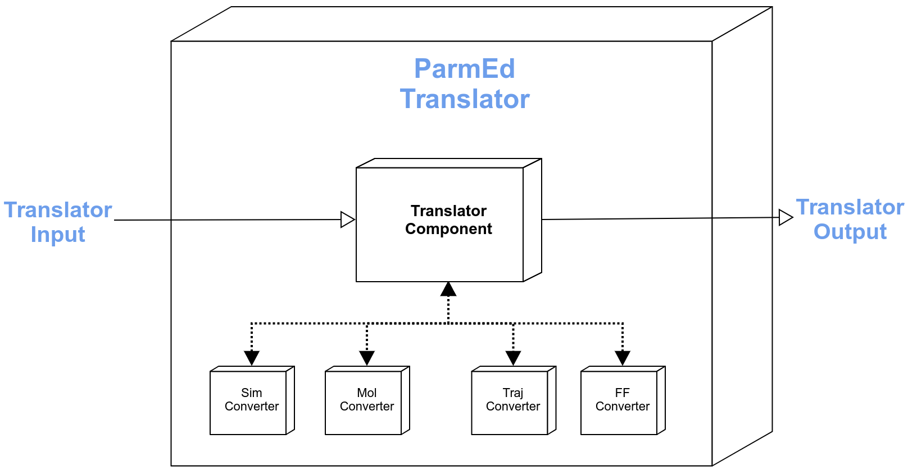

[//]: # (Badges)
[](https://github.com/MolSSI/mmic_parmed/actions?query=workflow%3ACI)
[](https://codecov.io/gh/MolSSI/mmic_parmed/branch/master)
[](https://lgtm.com/projects/g/MolSSI/mmic_parmed/context:python)

ParmEd translator for MMSchema
==============================
This is part of the [MolSSI](http://molssi.org) Molecular Mechanics Interoperable Components ([MMIC](https://github.com/MolSSI/mmic)) project. This package provides translators between MMSchema and [ParmEd](https://parmed.github.io/ParmEd/html/index.html).



# Basic API
**mmic_parmed** provides 4 classes of translators for: molecules, trajectories, simulation, and forcefields.

## Molecules
```python
from mmic_parmed.models import ParmedMol

# Convert MMSchema to ParmEd molecule
pa_mol = ParmedMol.from_schema(mm_mol) -> parmed.structure.Structure

# Convert ParmEd to MMSchema molecule
mm_mol = ParmedMol.to_schema(pa_mol) -> mmelemental.models.molecule.Mol

```
# Under the hood
## Molecules
The `from_schema` and `to_schema` methods in the `ParmedMol` model use translation components provided by **mmic_parmed** and **MMElemental** to convert between MMSchema and ParmEd.

```python
from mmic_parmed.components import ParmedToMolComponent, MolToParmedComponent
from mmic_parmed.models.import ParmedMol
from mmelemental.models.molecule import Mol
```

### MMSchema to ParmEd molecule
```python
# Creating MMSchema molecule
mm_mol = Mol.from_file(path_to_file)

# Running translator compute
pa_mol = MolToParmedComponent.compute(mm_mol)
```

### ParmEd to MMSchema molecule
```python
# Creating ParmEd input
pa_struct = parmed.load_file(path_to_file)
pa_mol = mmic_parmed.models.ParmedMol(mol=pa_struct)

# Running translator compute
mm_mol = Translator.compute(pa_mol)
```


### Copyright
Copyright (c) 2021, MolSSI


#### Acknowledgements
 
Project based on the 
[Computational Molecular Science Python Cookiecutter](https://github.com/molssi/cookiecutter-cms) version 1.5.
